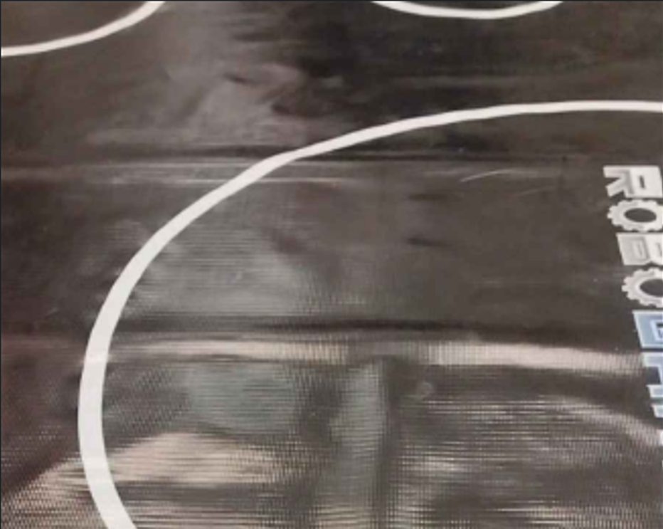
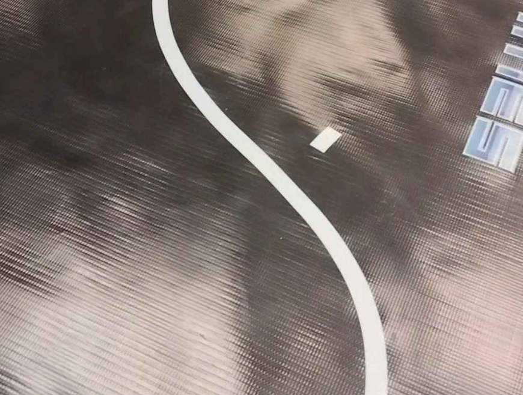
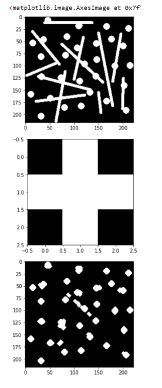
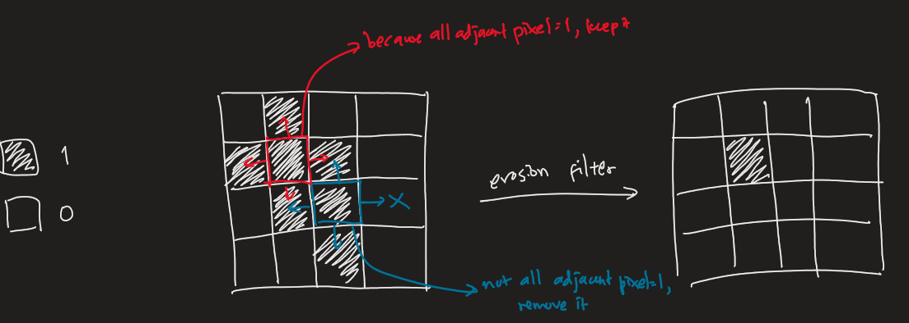
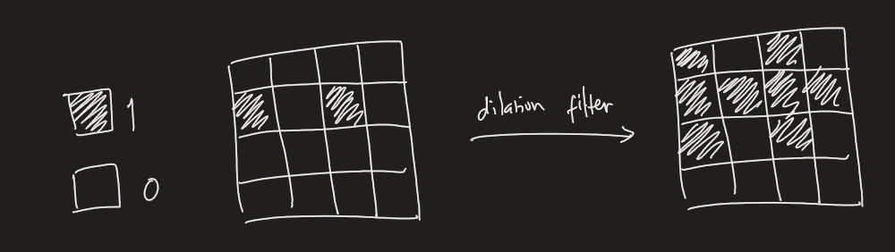
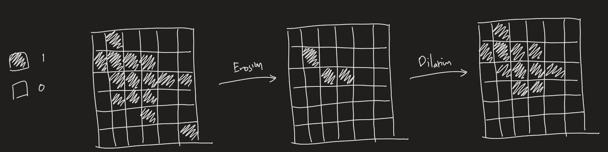
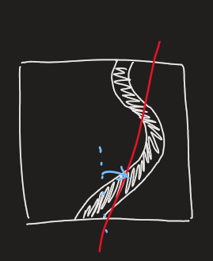
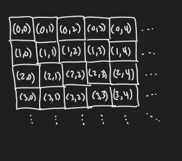
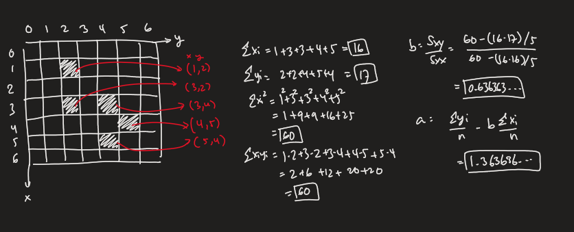
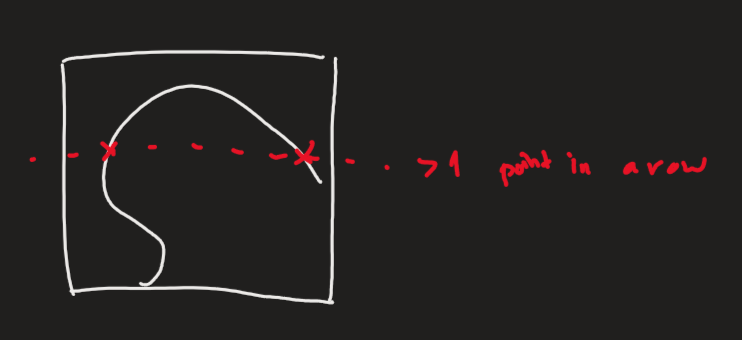

# Tutorial 1 Assignment: Line Follower Overcomplicated

> Sorry for the late release, I will try to make it as light but still fun and covers most concept discussed in tutorial 1. By how late this assingment is released I think you can know how I did not really enjoy writing this assignment 🫠
>
> Please note that this is more of an exercise of all the features discussed in the first tutorial. Actually, we do not really program like this (yet, at least) in the past year. So, no need to be intimidated. I think the assignment might not be well-designed too...

To compile, if you have `make` installed on your machine, you may directly use the command `make` and run `./line_follower.exe`

Otherwise, please run the following:
```
gcc -o line_follower.exe lib/image_proc.c lib/linalg.c lib/std.c images/image.c main.c
```

Moreover the convention for the library is that, if there are some function that modifies a matrix, then the matrix is passed by pointer. If it is not, it is passed by value.

## Part I - Macros, Dynamic Memory, and `void*`: Matrix Templating

> To be honest, the most annoying part to do in this assignment...

For this assignment, I would like to experiment around with macros by writing some matrix related functions first before working on the line follower code :)

I do not want to use a dynamic 2D array as it is wasteful as I need an extra space for containing the pointers to each 1D array... I want to contain them in a single 1D array and I will make a macro that maps 2D indexes to the array.

Start by going over `matrix.h` and try to understand what are the given macros doing.

- `define_matrix`: creates the definition for matrix that contains a certain type `T` given by user. This works as some form of templating. Note that header guards, as such:

    ```c
    #ifndef MATRIX_T
    #define MATRIX_T
        define_matrix(T);
    #endif
    ```

    are used to avoid double definition of the struct. Note:

    `#ifndef ... #endif`: Tells the compiler that if the identifier is NOT defined, assume the code enclosed exists. Otherwise, ignore it.

    `#define`: defines an identifier

- `Matrix`: the syntax to access the matrix defined by `define_matrix`

- `matrix_from_array2D`: Creates a matrix by copying from an existing 2D array. The parameter `__M` is the name for the **new variable**

- `matrix_print`: Prints a matrix, you need to provide a function that prints each individual elements

- `_sub`: For subscripting, i.e. `_sub(A, 1, 2)` means accessing the entry $A_{12}$ of the matrix. The first index is for the vertical axis, the second is for the horizontal. This is a safe way to access elements, as it will throw an error if you go out of bounds. But it returns an `rvalue`, you might want to use `_xsub`

- `_xsub`: The `x` is for forcefully ignoring error throwing, use this when you know what you are doing and you need an `lvalue`

- `matrix_check_not_overflow`: Self explanatory

- `matrix_from_matrix`: Creates a matrix by copying from an existing matrix. The parameter `__M` is the name for the **new variable**

- `matrix_copy`: Another name for `matrix_from_matrix`

- `matrix_all`: Creates a matrix by filling the matrix with the value indicated in `__value`, the size should be `__rows` $\times$ `__cols`. The parameter `__M` is the name for the **new variable**. This is your Task 1.1

- `matrix_op_matrix`: Perform an operation on matrix `__M1` and `__M2`, then store the result in `__M0`. `__op` can be any operator that works on the elements of the matrices. There are two additional operators `*x*` for matrix multiplication and `*s*` for matrix stacking. Suitable matrix size check has been done. Task 1.2 is about completing the matrix multiplication part.

- `matrix_op_self`: Perform an operation on the matrix itself. The modification will be done directly on the matrix. Any `__op` that works on each of the elements in matrix will work with the addition of `T*` that will transpose the matrix.

- `matrix_from_slice`: Takes elements from another within rows in the range $[\textsf{startrow}, \textsf{endrow})$ and columns in the range $[\textsf{startcol}, \textsf{endcol})$. The end index is **excluded**. `__M1` will be a new matrix. This is your Task 1.3

- `matrix_reshape`: Reshapes a matrix `__M` to `_new_rows` $\times$ `_new_cols`. Suitable checking has been done. To complete this is your Task 1.4


All macros will be completed in `matrix.h`

Some hints: 

1. Sometimes, you may want to put parentheses around your macro arguments and expression, e.g.

    `#define _sub(_M, _i, _j) _M.array[_i * _M.cols + _j]` might produce unintended result if I let `_i` to be `1+1+1+1` (Think about why)

    It is safer to do the following: `#define (_sub(_M, _i, _j) (_M).array[(_i) * (_M).cols + (_j)])`

    If you found that some implementation does not follow this rule, you may modify the definition in `matrix.h` if it causes compilation error somewhere in your code. I realized this problem too late.

2. You can hover on a macro and see how it is expanded; copy it and see why it produces a compilation error.

3. Remember to allocate memory for `.array` of **new matrices**

### Task 1.1: `matrix_all`
Complete the macro definition for `matrix_all` in `matrix.h`. Refer to the description of `matrix_all` above.

Note that this creates a **new matrix**. You may want to see the implementation of `matrix_from_matrix`.

Intended outcome: `testcase1()` in `main()` should produce the intended output given.

### Task 1.2: Matrix Multiplication in `matrix_op_matrix`
Complete the macro definition for `matrix_op_matrix` in `matrix.h` such that it can support matrix multiplication.

Recall that matrix multiplication does the following for a matrix $B$ with size $i \times k$ and matrix $C$ with size $k \times j$, resulting in a matrix of size $i \times j$ :

$A = B \times C \leftrightarrow A_{ij} = B_{i0}C_{0j} + B_{i1}C_{1j} + ... + B_{ik}C_{kj}$

So, for example:

```math
B = \begin{bmatrix}1 & 2 \\ 2 & 3 \\ 3& 4\end{bmatrix}, ~ C = \begin{bmatrix} 1 & 2 & 3 \\ 2 & 1 & 2\end{bmatrix}
```

Then $A$:

```math
A = \begin{bmatrix}1 \cdot 1 + 2\cdot 2 & 1\cdot 2 + 2 \cdot 1& 1 \cdot 3 + 2\cdot2 \\  2 \cdot 1 + 3\cdot 2 & 2\cdot 2 + 3 \cdot 1& 2 \cdot 3 + 3\cdot2 \\ 3 \cdot 1 + 4 \cdot 2 & 3 \cdot 2 + 4 \cdot 1& 3 \cdot 3 + 4\cdot2\end{bmatrix} = \begin{bmatrix} 5 & 4 & 7 \\ 8 & 7 & 12 \\ 11 & 10 & 17\end{bmatrix}
```

$A_{ij}$ means the element in the $i$-th row and $j$-th column in the matrix $A$.

> Note: `#__op` means the passed `__op` converted to a string, for example if I pass `@#$%` as `__op`, `#__op` will be `"@#$%"`
>
> Originally, I would like to make `__M0` be able to adjust to the size of the operation result, however, I was stuck on how to implement this because there is no way to get the type of __M0 and make a dynamic array variable out of it... until I realize maybe I can just make a temporary variable in the matrix to contain the previous dynamic array or make use of `void*`... Anyway, now you have to prepare a proper `__M0` to fit the operation result, use `matrix_all` to do this.
>
>Moreover, I will really like it if I can use `@` as the operation symbol, it gives me compilation error... 

Intended outcome: `testcase2()` in `main()` should produce the intended output given.

### Task 1.3: `matrix_from_slice`
Complete the macro definition for `matrix_from_slice` in `matrix.h`. Refer to the description of `matrix_from_slice` above.

You may assume that the user is cooperative and will not input indexes such that it overflows in `__M2`.

Note that this creates a **new matrix**. You may want to see the implementation of `matrix_from_matrix`.

Intended outcome: `testcase3()` in `main()` should produce the intended output given.

### Task 1.4: `matrix_reshape`
Complete the macro definition for `matrix_reshape` in `matrix.h`. Refer to the description of `matrix_reshape` above.

Also refer to the following example:

Imagine that you are reading a matrix from the top to bottom, left to right. For each element, write it in the reshaped matrix.

For example, if A:

```math
A = \begin{bmatrix} 2 & 3 \\ 3 & 4 \\ 4 & 5\end{bmatrix}
```
 
 is resized to a matrix of size $2\times3$:

```math
A' = \begin{bmatrix}2 & 3 & 3 \\ 4 & 4 & 5\end{bmatrix}
```

and if resized to a matrix of size $6 \times 1$:

```math
A' = \begin{bmatrix}2 \\ 3 \\ 3 \\ 4 \\ 4 \\ 5\end{bmatrix}
```

Intended outcome: `testcase4()` in `main()` should produce the intended output given.

Hint: This can be done without loops...

### Task 1.5: `Matrix(anyType)` 

Please refer to `main.c` for this task. Complete the syntax for dereferencing void pointers in `anyType_print()` above `testcase5()` such that `testcase5()` will print the intended output.

A matrix is defined such that it can contain different datatypes. This is achieved by defining a struct as such:
```c
typedef struct{
        char typename; //'c' for characters, 'i' for int, 'd' for double
        void* ptr;
} anyType;
```

You need to dereference the pointer correctly based on the type stated in typename. You may assume that the user is cooperative when creating objects with the type `anyType`.

Moreover, to make the creation of an object easier, the following macro (`v` for `void*`? -- I just make this up...) is defined:
```c
#define v(X) {_Generic((X), int:'i', double:'d', char:'c'), &(X)}
```

`_Generic()` is another feature of C, you may read about it [here](https://www.geeksforgeeks.org/_generic-keyword-c/) (I think you can also use this in STM32). It checks for the type of the argument passed to it, and based on its type, decide which value it takes. In this case `v(3)` will be `'i'` because it is of type `int`, `v(3.2)` will be `'d'` because it is of type `double`.

> I found out about this while trying to figure out how to make "function overloading" C. i.e. taking different parameters for a function.
> ```c
> void int_print(int x){printf("%d", x);}
> void double_print(double x){printf("%.2f", x);}
> #define print(X) _Generic(X, int: int_print(x), double_print(x))
> ```
> 
> This way, `print()` will work for both `int` and `double`
>
> Recall that function overloading is not a direct feature in C

## Part 2 - Function Pointers, Image Processing, and Using Library: Line Follower with Camera

Recently, I am thinking about how we will code the line follower if we need a camera. Although the competition we will plan to join which uses camera for line following have the lines on the borders of the track, let us first consider the situation of NatCar in RoboGames, which led to this experiment.

Unfortunately, I do not think that the solution I provide so far is quite good and there are a lot of drawbacks to it while it is complex (hence the title). If you do have some suggestions, please discuss it... I need your ideas :)

These are two images of the track that I have put into `image.c`.

### Image 1
</img>

### Image 2
</img>

(I downscaled both images to about the same resolution as I do not want to hurt your clipboard in `image.c` and I don't think practical to have a detailed camera resolution anyway)

For this task, we will mainly work in the file `image_proc.h` and `image_proc.h`, the structure `Color` is defined in `color.h`

It contains:

- `image_proc_process_color_point`: A function that takes in `Matrix(Color)` and evaluates an integer based on each channel of each elements of the color matrix. How the integer is evaluated is based on the function that you pass. This is your task 2.1

- `image_proc_light_dark`: A function that converts that assigns `1` (light pixel) to elements of a matrix if it is larger than a threshold and `0` (dark pixel) otherwise.

- `image_proc_opening_filter`: Performs opening filter to an image. This is your task 2.2

- `image_proc_coords_accumulate`: Sum up the $f(\textsf{coords})$ of coordinates that has value `1`. 

- `LineData`: A structure that contains the parameters of a line

- `image_proc_linreg`: Finds out the line of best fit based on some points. This is your task 2.3

- `image_proc_draw_line`: Draws a line on a `Matrix(int)`

- `PolyData`: A structure that contains the parameters of a cubic polynomial

- `image_proc_polyreg`: Finds out the cubic polynomial of best fit based on some points. This is your task 2.4

- `image_proc_draw_poly`: Draws a cubic polynomial on a `Matrix(int)`

### Task 2.1: Grayscaling

Recall that we have done grayscaling in the software tutorial before RDC. Now, let us make a generalized version of this. 

RGB color system has 3 channels. Complete the argument list of `image_proc_process_color_point` (int both `image_proc.h` and `image_proc.c`) and write a suitable function `grayscale` that takes each channel value as its argument (you are allowed to define a new function) that you can pass into `image_proc_process_color_point`. 

Recall that: 

$V = R \cdot 0.2989 + G \cdot 0.5870 + B \cdot 0.1140$

Intended outcome: `testcase6()` and `testcase7()` in `main()` should produce the intended output given.

### Task 2.2: Opening Filter

Despite using the grayscaling and using the thresholding method, the line is still not clearly extracted and there are light patches in the image (actually one of the main problems we encountered when developing the line follower of NatCar).

Let's attempt to perform opening filter on the image after grayscaling and thresholding and see if it will be any better.

Opening filter is supposedly able to remove noises that are not in one cluster large cluster (may be repeated for some iterations).



Opening filter has two parts:

- Erosion filter:

    For every pixel in the image, if all adjacent pixels (vertically and horizontally) are not `1` in the original image. Then that pixel will be converted to `0`. 

    For example:

    

    Pixels outside of the boundary are assumed to be `0`.

    The provided macros `_vsub` (valid subscription?) and `matrix_check_not_overflow` might be useful

- Dilation filter:

    For every pixel in the image, if it is `1` in the original image, then all adjacent pixels (vertically and horizontally) will also be set to 1 (except those outside of boundary)

    

Applying erosion filter, followed by dilation filter is the opening filter.

For example:



In doing these operations, you do not have to do it in place. You may allocate a new dynamic array and later assign it to the matrix. However, remember to free unused dynamic memory.

Despite this method, as seen in the sample output, it does not really remove some cluster of noises, although it did a great work removing small stray noise clusters. Please suggest some method if you can think of some way of removing these unwanted clusters.

Intended outcome: `testcase8()` in `main()` should produce the intended output given.

### Task 2.3: `image_proc_linreg`

> This is the approach I was experimenting around with while working on this assignment...

Now, we have a relatively clean image of the line follower track. I would like to try to draw a line to in some sense, approximate the turning angle for the line follower at that point



Consider the image coordinate system that is defined as such:



$(0,0)$ is the top left corner, and $x$ coordinate is increasing as we go down the vertical axis while $y$ coordinate is increasing as we go to the left.

Now, for in the image containing `0` and `1`, Only consider points that has value `1` contained in it, list all of them (any order is fine) and let the $i$-th point be $(x_i, y_i)$, to find the line of best fit then:

If the line is $y = bx + a$

```math
b = \frac{S_{XY}}{S_{XX}} = \frac{\sum_{i=0}^N{x_iy_i} - (\sum_{i=0}^N{x_i})(\sum_{i=0}^N{y_i})/N }{\sum_{i=0}^N{x_i^2} - (\sum_{i=0}^N{x_i})^2/N}~ \textsf{and}~ a= \frac{\sum_{i=0}^N y_i}{N} - b  \frac{\sum_{i=0}^N x_i}{N}
```

Given that $N$ is the amount of points in the list.

This might look intimidating, but for this task you just need to complete the evaluation of $\sum_{i=0}^N x_i$, $\sum_{i=0}^N y_i$, $\sum_{i=0}^N x_i y_i$, $\sum_{i=0}^N x_i^2$ 

To make it clear, here is an example: 



For this task, carefully consider what `image_proc_coords_accumulate` is doing and what function should you pass to it to get the intended sums.

Intended outcome: `testcase9()` in `main()` should produce the intended output given.

> To be honest, now that I think about it, it might not be necessary to do something this complex; but I think I'll just make use of this opportunity to play around with possible methods. Enjoy your assignment :)

### Task 2.4 `image_proc_polyreg`

As we have implemented templated matrix, why not continue on and do some linear algebra? We can fit the line follower track to something more complex, maybe a polynomial?

Let's say we have the list of points $(x_i, y_i)$ as before, we want to find a cubic polynomial such that, hopefully:

```math
\begin{cases}a_0 + a_1x_1 + a_2x_1^2 + a_3x_1^3 = y_1 \\ a_0 + a_1x_2 + a_2x_2^2 + a_3x_2^3 = y_2 \\ \vdots \\ a_0 + a_1x_N + a_2x_N^2 + a_3x_N^3 = y_N \end{cases}
```

This is equivalent to a system of linear equation as such:

```math
\underbrace{\begin{bmatrix}1 & x_1 & x_1^2 & x_1^3 \\ 1 & x_2 & x_2^2 & x_2^3 \\ \vdots & \vdots & \vdots & \vdots \\ 1 & x_N & x_N^2 & x_N^3 \end{bmatrix}}_{A} \underbrace{\begin{bmatrix}a_0 \\ a_1 \\ a_2 \\ a_3\end{bmatrix}}_x = \underbrace{\begin{bmatrix}y_1 \\ y_2 \\ \vdots \\ y_N\end{bmatrix}}_b
```


However, this equation might not have a solution, as there might be some random error in the image or the track being more complicated than a cubic polynomial, etc.

To approximate a solution (the matrix $x$), then we need to find the solution to:

```math
A^\top A x = A^\top b \to x  = (A^\top A)^{-1}A^\top
```

(This is the least squares solution method)

> Ehh... don't ask me why... I just read this somewhere.. I actually haven't took a linear algebra course yet :)

$A^\top$ is the transpose of a matrix, i.e. each columns of $A$ will become rows of $A^\top$, e.g.

```math
A = \begin{bmatrix} 1 & 2 \\ 2 & 3 \\ 3 & 4 \end{bmatrix}\to A^\top = \begin{bmatrix}1 & 2 & 3 \\ 2 & 3 & 4\end{bmatrix}
```

This is already implemented in `matrix_op_self` using the self-defined operator `T*`

$A^{-1}$ is the inverse of a matrix, it works somewhat like a divisor of $A$ such that when they are multiplied together $A^{-1}A$ will give the identity matrix (works like $1$ in some sense)

This is also already implemented in `linalg.c`, please refer to `mmatrix_linalg_get_inv` for the parameters


To conclude this assignment, use the implemented matrix library to evaluate $x$, put it inside the matrix `x`. Do this in `image_proc_polyreg`. I have constructed the matrices $A$ and $b$ for you.

> Actually I can kind of agree that the resulting matrix library is annoying to use... let's see if we may have some way to improve it and make it convenient to use... this needs to be considered if we were to try writing a library for the subteam...

> I was thinking about this for a while and it seems that actually, done correctly, the computation can be done quite fast. $A^\top A$ can be calculated in $O(N)$ time, the resulting matrix is a $4 \times 4$ matrix and it will always take constant time to invert. $A^\top b$ will similary take $O(N)$ time, resulting in a $4 \times 1$ matrix. Multiplying them together will also take constant time.
>
> However, the issue with this method is that it assumes that in a row there can only be one point
> It might not work on some track that look like this, no matter how hard we try
>
>
>
> I was thinking if I can use Bezier curve or something like that. Anyway... this might get too theoretical and might not even produce a result that can be significantly better... I'll leave experimenting with that for later, but it is inspired by this video [here](https://youtu.be/BQvBq3K50u8?si=P3si0ljucg4UfGdv) of making animation in desmos.
>
> Anyway, if you do have some suggestion for the line following method or how to remove the noise in the bitmap as shown earlier, please do discuss it. It will be very useful for our RnD.
>
> But as you can see... most of the problem actually also comes from the noises of parts that are not the line... the mat in RoboGames NatCar is very reflective and we even need to use cardboard to cover the light sensors...
>
> Moreover, as I provide two images, you may try to use the second one... If I recall correctly, the threshold I set does not work well on that one... I wonder if there is some method that we can use to find the threshold given the condition of the lighting is not to our advantage. I tried Otsu's method (if you know about it), it does not work well. 
>
> Oh... actually I haven't tried to search up online what is the common method to do this or ask ChatGPT/Poe for suggestions.. maybe I should :)
